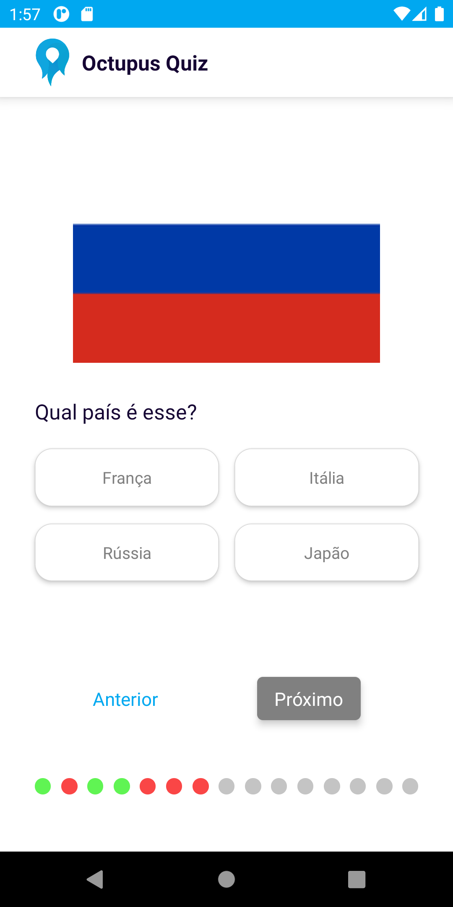

# Octupus Quiz

> Desenvolvido por João Victor Cabral como parte do desafio do processo seletivo de React Native Developer

## Resultado final

   


## Como executar

### Aplicação compilada

Para rodar a versão já compilada do aplicativo, basta fazer o <a href="https://github.com/cabraljv/octupus_quiz/releases/download/v1.0/octupus_quiz_v1.apk">download</a> do apk e instala-lo no seu dispositivo.

### Ambiente de desenvolvimento

Para iniciar a aplicação em ambiente de desenvolvimento, basta configurar seu ambiente de acordo com o que pede a <a href="https://reactnative.dev/docs/environment-setup">documentação oficial do React Native</a> antes de seguir os próximos passos.

Para instalar as dependências basta rodar o comando:

```sh
yarn
``` 


Para rodar a aplicação basta rodar o comando

```sh
yarn android
``` 

ou

```sh
yarn ios
``` 